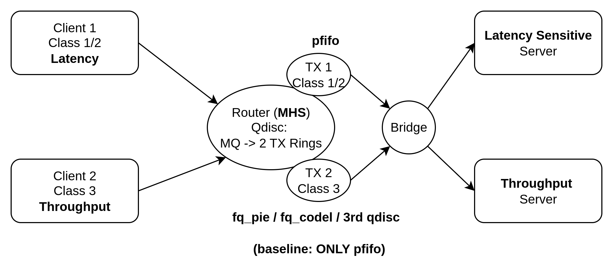

# Multiq in Linux

## Installation
NOTE: All scripts require root privileges, so make sure to use sudo!

- Make sure installation.sh is executable:
`chmod +x installation.sh`
- Run the install script:
`sudo ./installation.sh`

## How to run

- Make sure to run as root user (sudo su) or use sudo.
- Run the `main` script (entrypoint):

`./main.sh -h`
-  Go through the usage to understand the flags, required & optional arguments.
- Run the main script with the test-name, qdsics to test:

`./main.sh -n 10 test-name fq_codel fq_pie`
- Convert the json to csv to generate graphs:
`./parse-json.sh`

## Topology

